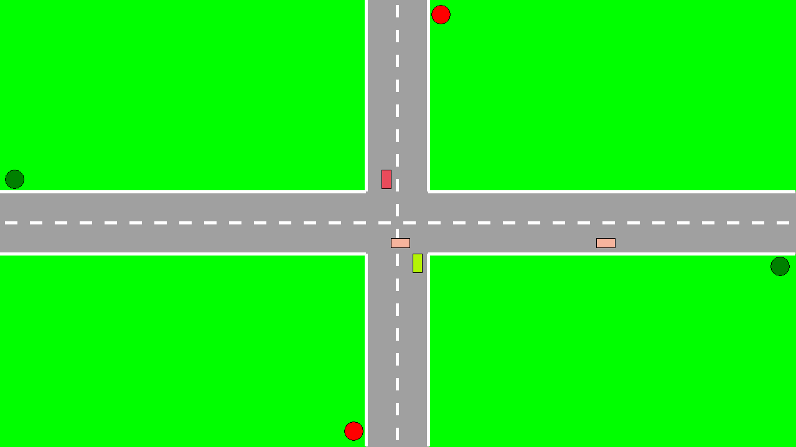

# Traffic Simulation

This Python-based project uses Tkinter to simulate traffic at an intersection, demonstrating concepts of multithreading, semaphore-based synchronization, user interaction, and collision avoidance.

## Features

- **Graphical Interface**: Utilizes Tkinter to visually represent an intersection complete with traffic lights, providing a simple and intuitive display.
- **Multithreading**: Leverages multiple threads to simulate independent vehicle movements and traffic light controls, enhancing the simulation's realism and complexity.
- **Semaphore Synchronization**: Employs semaphores to manage the flow of traffic through the intersection effectively. This ensures that traffic lights coordinate smoothly, preventing gridlock and enhancing safety.
- **Dynamic User Interaction**: Allows users to spawn cars in real-time by pressing arrow keys, simulating incoming traffic from different directions.
- **Safe Application Termination**: Provides a safe shutdown process by capturing the "Q" key event, ensuring all threads are gracefully stopped before the application exits to prevent data corruption or application crashes.
- **Collision Avoidance**: Uses a sophisticated non-blocking collision detection system to maintain a safe distance between cars, thereby preventing accidents.
- **Dynamic Car Orientation**: Supports random directional changes at intersections, with visual representation reflecting the car's new travel direction.

## Detailed Thread and Synchronization Mechanism Description

### Main Window Thread

- **Responsibilities**: Manages the drawing of the user interface and processes user input events. It also updates the GUI components to reflect the current state of the simulation.
- **Critical Operations**: Handling event queue processing and GUI updates.

### Car Threads

- **Functionality**: Each car thread simulates the movement of an individual car. It calculates the car's position, checks semaphore status to observe traffic light rules, handles collision detection, and redraws the car in its new position and orientation after maneuvers.
- **Synchronization**: Car threads interact with semaphores to check whether they can proceed through an intersection or must wait for the light to change.

### Traffic Light Thread

- **Operation**: This thread periodically toggles the state of the traffic lights from green to red and vice versa, which directly affects the flow of traffic through semaphores.
- **Impact**: Dictates when car threads are allowed to move through the intersection or must stop due to a red light.

## Critical Section Management

### Protected Variable: `intersection_crossed_counter`

- **Usage**: This variable counts each car that successfully crosses the intersection. It is accessed and modified by multiple car threads.
- **Lock Mechanism**: A mutex lock (`Lock`) protects this variable, ensuring that updates are atomic and no data races occur.

